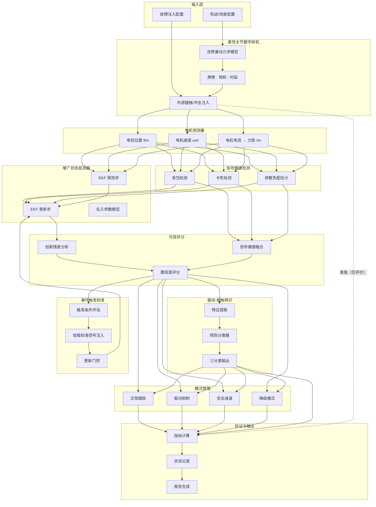

# 历史系统架构

> 本文件仅用于历史追溯。当前架构以 [`docs/02_architecture/system_architecture.md`](../docs/02_architecture/system_architecture.md) 为准。

## 系统架构图



## 数据流说明

| 连线 | 数据内容 | 备注 |
|------|----------|------|
| A1 → B1 | 场景参数（载荷、轨迹、持续时间） | JSON Schema 定义格式 |
| B3 → C1~C3 | 传感器模拟输出 | 可叠加故障注入 |
| C1~C3 → E1 | 测量值 θm, ωm, τm | Observer 唯一输入 |
| E2 → F1 | 创新残差向量 | 3 维：位置、速度、力矩 |
| F3 → H1~H4 | 可信评分 + 分类结果 | 驱动模式切换 |
| F3 → I1 | 可信评分 | 触发校准的条件 |
| B3 → J1 | 真值 θl, ωl, τext | 仅用于评价，不进入 Observer |

## 模块依赖关系

```
01_plant/  (独立)
     ↓
02_observer/  (依赖 01_plant 的仿真输出)
     ↓
03_confidence_trigger/  (依赖 02_observer 的估计结果)
     ↓
04_classification/  (依赖 02_observer 和 03_confidence 的输出)
     ↓
05_control/  (依赖 02_observer, 03_confidence, 04_classification)
     ↓
06_validation/  (依赖所有上游模块的输出)
     
07_app/  (依赖 01-06 的上层应用)
08_sil/  (01-05 的 C 实现)
09_test_agent/  (测试编排工具)
```

## 关键接口

详细接口定义见 `interface_spec.md`。核心数据交换格式为 JSON（通过公共 Schema 定义），模块间通过标准化结构体传递：

- `ScenarioConfig` → 场景配置
- `SystemState` → 系统状态（估计 + 评分）
- `ValidationReport` → 验证报告
