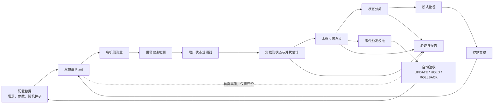

# 系统架构

## 总体数据流



## 数学模型与力矩侧定义

当前统一采用电机侧角度 `theta_m`、电机侧角速度 `omega_m`、负载侧角度
`theta_l` 和负载侧角速度 `omega_l`。传动比方向冻结为：理想刚性传动时
`theta_l = theta_m / N`，其中 `N > 0`。

`tau_s_load_nm` 明确定义为负载侧传动弹性力矩：

```text
tau_s_load_nm
= K_s * (theta_m / N - theta_l)
+ D_s * (omega_m / N - omega_l)
```

负载侧动力学为：

```text
J_l * domega_l
= tau_s_load_nm - tau_ext_nm - tau_fl_nm
```

负载侧弹性力矩反射到电机侧后为：

```text
tau_s_motor_nm = tau_s_load_nm / (eta * N)
```

当前 P1 暂按理想传动效率 `eta = 1`，因此电机侧动力学为：

```text
J_m * domega_m
= motor_torque_applied_nm - tau_s_load_nm / N - tau_fm_nm
```

`tau_ext_nm` 的正方向冻结为负载侧正运动方向上的阻力矩，因此在负载侧方程中
取负号。摩擦力矩必须与对应角速度方向相反。若后续引入传动效率、回差或其他
齿轮模型，必须通过独立接口变更更新上述定义，不得只修改某一处代码。

在无输入、无外扰、无摩擦、无阻尼且 `eta = 1` 时，Plant 必须通过机械能一致性
检查。总能量定义为：

```text
E
= 0.5 * J_m * omega_m^2
+ 0.5 * J_l * omega_l^2
+ 0.5 * K_s * (theta_m / N - theta_l)^2
```

数值积分误差之外，能量不得由齿轮映射凭空产生或消失。该检查是 P1 重新运行前
的强制前置条件。

## 电机力矩链路

运行链路必须区分：

```text
torque_command_nm
-> saturation / actuator model
-> motor_torque_applied_nm
-> Plant

motor_torque_applied_nm
-> torque measurement model
-> motor_torque_measured_nm
-> Observer
```

没有独立转矩测量模型时，P1 可以暂时使用：

```text
motor_torque_measured_nm
= motor_torque_applied_nm + measurement_noise_nm
```

Observer 禁止直接使用未经执行器模型处理的 `torque_command_nm`。Plant 和
Observer 每个采样点使用的实际施加力矩与测量力矩必须可追溯并进入评价记录。

## 数据分层

### 运行时数据

运行时链路只使用电机侧测量、有效性标志、估计结果、工程评分、分类状态、运行
模式和控制命令。模块只能消费接口规范中声明的字段。

### 仿真真值

负载侧真实位置、真实速度、真实外部扰动力矩和 Plant 真实参数属于仿真真值。
真值只能流向 Validation，不得进入 Observer、Confidence、Classification、
Mode Manager 或 Control。

### 评价数据

评价数据包括误差、均方根误差、最大误差、有限性、发散标志、误报、漏报、
运行时间和随机种子。评价模块不得把真值回写到运行时模块。

### 配置数据

场景、负载等级、采样时间、持续时间、噪声、参数失配、随机种子和门限属于配置
数据。配置必须版本化，并与结果一起保存提交标识。

## 模块边界

| 模块 | 主要输入 | 主要输出 | 边界 |
|---|---|---|---|
| Scenario / Config | 版本化配置 | 轨迹、场景、负载和故障参数 | 不直接产生算法结论 |
| Plant | 控制输入、Plant 真实参数 | 电机侧测量、仿真真值 | 真值不得进入运行时算法 |
| Signal Health | 电机侧测量及有效性 | 健康标志、原因码 | 不估计负载状态 |
| Observer | 电机侧测量、Observer 名义参数 | 负载侧状态、外扰估计、创新残差 | 禁止读取 Plant 真值 |
| Confidence | 创新残差、信号健康、物理检查 | `confidence_score`、有效性、原因码 | 评分不是概率 |
| Classification | 估计结果、特征、可信信息 | `classification_state`、`contact_score` | P2 前不得宣称有效接触识别 |
| Mode Manager | 分类状态、可信评分、健康信息 | `operation_mode` | 不直接实现底层控制算法 |
| Control | 运行模式、状态估计、指令 | 控制输入 | 低可信时必须保守降级 |
| Calibration | 触发条件、历史评价 | 候选参数 | 不直接覆盖当前可信参数 |
| Validation | 仿真真值、运行时输出 | 指标、决定、报告 | 不向运行时链路泄漏真值 |

## 实现视图

| 实现层 | 规划职责 | 当前阶段 |
|---|---|---|
| MATLAB/Simulink | Plant、Observer、MIL 和主仿真证据 | 由 Simulink 同学负责；历史执行结果为 `FAIL`，当前可行性为 `NOT_VERIFIED` |
| Python | 公共契约、独立最小参考、数据检查和基础测试 | 本工作包只维护契约与基础测试 |
| C/C++ SIL | Observer、模式管理、异常保护和一致性验证 | P1 门禁前不启动 |
| App | 场景配置、状态展示、曲线和报告 | P1 门禁前不启动 |
| Test Agent | 批量实验、证据检查和报告辅助 | P1 门禁前不启动 |

Python 最小参考实现只用于独立验证，不替代 MATLAB 主实现，也不转移各模块负责
同学的源码、测试、运行结果和技术说明责任。

## 控制与校准闭环

运行模式统一为正常跟踪、振动抑制、安全减速和低可信降级。事件触发校准只在
启动、工具切换、负载变化、残差持续增大、可信评分下降或预定维护时刻发生。
候选参数必须经过自动验收，结果只能是 `UPDATE`、`HOLD` 或 `ROLLBACK`。

## 阶段约束

- 当前只冻结接口和边界，不把已有目录或占位代码视为验证证据。
- 当前 P1 可行性状态为 `NOT_VERIFIED`，P2 和 P3 保持阻断。
- 历史 P1 `FAIL` 只表示旧脚本曾运行失败，不作为当前技术路线不可行的证据。
- P1/P2/P3 未形成可复验证据前，不对外声明接触识别、可信安全控制或实时性能。
- 每个主体模块由对应同学在独立分支和 PR 中实现、运行和说明。
