# 系统架构

当前规范、实现和验证状态统一见
[`current_status_and_next_steps.md`](../current_status_and_next_steps.md)。本文件只定义
架构、数学模型和不变量，不重复维护阶段状态。

## 总体数据流

```mermaid
flowchart LR
    Scenario["场景与不可变 Plant 真值配置"] --> Reference["参考轨迹"]
    Reference --> Controller["Controller"]
    Mode --> Controller
    Controller --> Command["ActuatorCommand"]
    Command --> Actuator["执行器模型"]
    Actuator --> Trace["PlantInputTrace"]
    Trace --> Plant["双惯量 Plant"]
    Plant --> Raw["RawMotorMeasurement"]
    Raw --> Torque["TorqueFeedback / 电流换算"]
    Raw --> Health["SignalHealthStatus"]
    Torque --> Health
    Raw --> ObserverInput["ObserverInput"]
    Torque --> ObserverInput
    Health --> ObserverInput
    ObserverInput --> Observer["Observer"]
    Nominal["VersionedNominalParameterStore"] --> Observer
    Observer --> Estimate["ObserverEstimate"]
    Estimate --> Confidence["ConfidenceOutput"]
    Health --> Confidence
    Confidence --> Classification["ClassificationOutput"]
    Estimate --> Classification
    Confidence --> Mode["ModeDecision"]
    Classification --> Mode
    Mode --> Snapshot["SystemStateSnapshot"]
    Estimate --> Snapshot
    Confidence --> Snapshot
    Classification --> Snapshot
    Confidence --> Calibration["CalibrationCandidate"]
    Health --> Calibration
    Mode --> Calibration
    Calibration --> Acceptance["Calibration Acceptance"]
    Acceptance --> Decision["CalibrationDecision"]
    Decision --> Nominal
    Plant -. "仿真真值，仅供离线评价" .-> Validation["Offline Validation"]
    Trace --> Validation
    Snapshot --> Validation
```



`PlantInputTrace` 是仿真和离线追踪数据。Observer 不得读取其中的
`motor_torque_applied_nm`。App、报告工具和 Test Agent 也不进入实时控制环。

## 数学模型与力矩侧定义

电机侧角度和角速度分别为 `theta_m`、`omega_m`，理想齿轮输出侧、柔性元件之前的
坐标为 `theta_g`、`omega_g`，负载侧角度和角速度为 `theta_l`、`omega_l`。本阶段
只采用理想齿轮：

```text
eta = 1
theta_g = theta_m / N
omega_g = omega_m / N
q = theta_g - theta_l
q_dot = omega_g - omega_l
```

`theta_g` 与 `theta_l` 由柔性元件隔开，二者不能写成恒等关系；否则会错误地令
`q=0` 并消除项目要研究的柔性动态。

`tau_s_load_nm` 是负载侧传动弹性力矩：

```text
tau_s_load_nm = K_s * q + D_s * q_dot
tau_s_motor_nm = tau_s_load_nm / N
```

电机侧动力学为：

```text
J_m * omega_m_dot
= motor_torque_applied_nm
- tau_s_motor_nm
- tau_fm_resist_nm
```

`tau_fm_resist_nm` 是带运动方向的电机侧阻力项，按
`b_m*omega_m + tau_c_m*sign(omega_m)` 定义，因此在方程中统一减去。

负载侧外部作用和摩擦统一使用带符号广义力矩：

```text
J_l * omega_l_dot
= tau_s_load_nm
+ tau_ext_nm
+ tau_fl_nm
```

`tau_ext_nm > 0` 表示外部作用沿负载坐标正方向；`tau_fl_nm` 是实际摩擦广义力矩，
在正常摩擦模型中与 `omega_l` 方向相反。不得再把正值 `tau_ext_nm` 同时描述为
“沿正方向”和“阻力矩幅值”。

非理想齿轮效率、回程差和双向功率流属于后续模型扩展。本阶段不冻结一般效率
反射公式，任何扩展都必须重新完成虚功、功率和能量推导。

## 能量一致性

在无输入、无外扰、无摩擦且 `eta=1` 时：

```text
E
= 0.5 * J_m * omega_m^2
+ 0.5 * J_l * omega_l^2
+ 0.5 * K_s * q^2

dE/dt = -D_s * q_dot^2
```

当 `D_s=0` 时，除数值积分误差外总机械能守恒；当 `D_s>0` 时，能量按上述耗散率
单调下降。能量检查、虚功检查和雅可比有限差分检查是 P1 运行前置条件。

## 运行时力矩链

```text
ActuatorCommand.torque_command_nm
-> actuator limit / dynamics
-> PlantInputTrace.motor_torque_applied_nm
-> Plant

RawMotorMeasurement + torque conversion source
-> TorqueFeedback.motor_torque_feedback_nm
-> ObserverInput
-> Observer
```

`motor_torque_feedback_nm` 可以来自电流换算、转矩传感器或受控执行器模型估计，
必须同时提供来源、有效性和标准差。它不保证来自独立转矩传感器，也不等同于
`motor_torque_applied_nm`。

## 配置域隔离

### `ImmutablePlantTrueConfig`

- 持有 Plant 真实惯量、刚度、阻尼、摩擦、执行器限制和场景真值；
- 单次实验开始后不可修改；
- 只允许 Scenario、Plant 和 Offline Validation 使用；
- Observer、Confidence、Calibration 和 Controller 禁止读取。

### `VersionedNominalParameterStore`

- 持有 Observer 和 Controller 可用的名义参数版本；
- 与 Plant 真值对象完全分离；
- 每次更新保留基版本、候选版本、证据和上一有效版本；
- 只有经过 Acceptance 的 `UPDATE` 可以原子写入。

Calibration 只能生成 `CalibrationCandidate`。`HOLD` 不修改当前版本，`ROLLBACK`
恢复明确记录的上一有效版本。Calibration 和 Acceptance 都不得回写
`ImmutablePlantTrueConfig`。

在线验收只能使用运行时可得信号和代理指标。Offline Validation 可以读取真值评价
候选，但其结论不得控制同一次在线更新。

## 数据边界

### 运行时数据

运行时链路使用命令、原始电机侧测量、转矩反馈、健康状态、估计、工程评分、分类、
危险锁存、运行模式和控制命令。模块只能读取其专用 DTO 声明的字段。

### 仿真与离线追踪数据

`motor_torque_applied_nm`、Plant 真实状态、真实外部力矩和 Plant 真实参数只进入
Plant 或 Offline Validation，不得出现在 `ObserverInput` 中。

### 评价数据

评价数据包括误差、有限性、发散、事件指标、运行时间、随机种子、配置版本和证据
索引。评价模块不得把真值回写到运行时模块。

## 模块边界

| 模块 | 主要输入 | 主要输出 | 强制边界 |
|---|---|---|---|
| Scenario | 版本化场景 | 参考轨迹、不可变 Plant 真值配置 | 不直接作算法结论 |
| Actuator | `ActuatorCommand` | `PlantInputTrace` | 明确饱和和执行器限制 |
| Plant | `PlantInputTrace`、真实参数 | 原始电机测量、仿真真值 | 真值只进入离线评价 |
| Torque Feedback | 原始电流或转矩信号 | `TorqueFeedback` | 提供来源、有效性和不确定度 |
| Signal Health | 原始测量和转矩反馈 | `SignalHealthStatus` | 不估计负载状态 |
| Observer | `ObserverInput`、名义参数 | `ObserverEstimate` | 禁止读取 applied torque 和 Plant 真值 |
| Confidence | Observer 和 Health 输出 | `ConfidenceOutput` | 评分不是概率，不依赖 Classifier |
| Classification | Estimate 和 Confidence | `ClassificationOutput` | P2 前不得宣称可靠辨识 |
| Mode Manager | Confidence、Classification、危险状态 | `ModeDecision` | 模式不得清除危险锁存 |
| Controller | 参考、估计、ModeDecision | `ControlCommand` | 动作不得弱于安全包络 |
| Calibration | 运行时诊断和当前名义版本 | `CalibrationCandidate` | 不直接修改参数或模式 |
| Acceptance | 候选、代理指标、备份 | `CalibrationDecision` | 不在线读取负载侧真值 |
| Validation | 真值、追踪数据、只读快照 | 阶段报告 | 不向运行时链路回流真值 |

## 阶段约束

- 目录、Mock、Schema 或规范存在不表示算法实现或性能通过。
- 详细当前状态只以
  [`current_status_and_next_steps.md`](../current_status_and_next_steps.md) 为准。
- P1/P2/P3 未形成有效证据前，不对外声明接触识别、可信安全控制或实时性能。
- 各主体模块由责任矩阵指定的同学实现、运行和说明。
