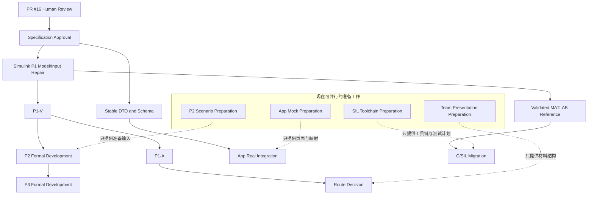

# FlexSense-Guard 全队并行准备计划

本文档只安排准备工作。

本文档不表示：

- Plant 已经修复；
- EKF 已经有效；
- P1 已经通过；
- P2/P3 已经开始；
- App、SIL 或 Test Agent 已经实现；
- 安全控制已经验证。

当前状态的唯一权威来源是
[`current_status_and_next_steps.md`](../current_status_and_next_steps.md)。本计划只说明
各模块现在可以准备什么，不维护另一份阶段状态。

## 当前项目阶段

项目状态不在本文重复维护，必须在开始任务前查看权威状态文件。本文不改变 P1、
P2、P3 或任何子门状态。

当前准备前提是 PR #16 仍为 Draft 且人工技术审查尚未完成。主体开发不能全面启动，
因为数学语义、输入链和阶段门尚未获得对应模块负责人批准，P1 也没有有效证据。
此时直接开发 P2、完整 App 或 C/SIL，会把未获批准的接口和无效算法固化到下游。

## 准备工作边界

### 不依赖有效 P1、现在可并行开展

- PR #16 人工技术审查和问题登记；
- P1 数学模型、MATLAB 文件影响范围和测试方案审查；
- P2 场景、标签、数据需求和事件级评价方案；
- Mock 驱动的只读 App 信息架构和字段映射；
- C/SIL 工具链、类型映射、回放和测试方案；
- 团队汇报材料结构、任务依赖和交接清单。

### 必须等待前置门禁

| 主体工作 | 最低前置条件 |
|---|---|
| MATLAB Plant、Observer 和 P1 runner 修复 | PR #16 数学及接口内容获得对应真人审查 |
| 正式 P1-V/P1-A 评价 | MATLAB 输入链修复、测试通过、门限预注册、评价集未解封 |
| P2 分类训练和正式实验 | P1-V 形成有效 `PASS` 证据 |
| P3 正式开发和实验 | P1-V 通过，并满足所依赖的 P2 子门 |
| App 真实数据集成 | DTO/Schema 获批，真实生产者输出可用 |
| C/SIL 算法迁移 | 有效、可复验的 MATLAB 参考和获批跨语言契约 |

## 公共交接关系

| 输入或输出 | 生产者 | 当前消费者 | 边界 |
|---|---|---|---|
| PR #16 候选规范 | 项目负责人同学 | 全部模块同学 | `REVIEWED`，不是 `FROZEN` |
| 数学与 MATLAB 可实现性意见 | Simulink 同学 | 项目负责人同学 | 只审查，不在准备包中改算法 |
| P2 场景、标签和数据需求 | 深度学习通感算同学 | Simulink、项目负责人同学 | 不训练，不冻结最终阈值 |
| DTO 到 UI 映射和页面状态 | 计算机软件同学 | 项目负责人及后续 App 实现 | Mock 必须显著标识 |
| DTO 到 C 映射和 SIL 测试计划 | 嵌入式 Linux 同学 | 项目负责人、Simulink 同学 | 不形成稳定 ABI 声明 |
| 模块审查意见、风险和阻塞项 | 各模块负责同学 | 项目负责人同学 | 不清楚或不可实现必须显式反馈 |

## PL-READY-01：项目负责人并行准备工作包

- **主责同学**：项目负责人同学
- **审查同学**：Simulink 同学及至少一位非作者模块同学

```text
Specification Status: DRAFT
Implementation Status: PARTIAL
Verification Status: NOT_VERIFIED
```

这里的 Implementation 指计划、模板、Issue、风险和审查矩阵等准备交付物已经部分
形成，不表示主体算法实现，也不表示真人审查完成。

### 任务目标

组织规范审查、保持状态与接口一致，并为每个模块提供可领取、可审查、可交接的
准备任务。

### 当前可以完成

1. 组织 PR #16 的技术审查；
2. 整理审查意见；
3. 维护当前状态唯一来源；
4. 维护阶段门和 A/B/C 路线；
5. 检查真值隔离；
6. 检查公共接口边界；
7. 检查各模块输入输出；
8. 更新风险登记；
9. 更新决策日志；
10. 建立各模块 Issue；
11. 审查模块 PR；
12. 组织最终集成。

### 输入与输出

| 类型 | 内容 | 生产者或消费者 |
|---|---|---|
| 输入 | PR #16、当前状态、职责矩阵、风险和模块反馈 | 仓库与各模块同学 |
| 输入 | Python/Schema 契约测试结果 | 公共契约测试 |
| 输出 | 审查意见表、Issue 清单、依赖图和交付检查表 | 各模块同学消费 |
| 输出 | 更新后的规范验证矩阵、风险与决策记录 | 全队和后续 PR 消费 |

### 依赖与阻塞

- 规划与审查组织可以在 PR #16 保持 Draft 时继续；
- 人工审查结果依赖对应模块同学提交真实 Review；
- 本工作包不得授权任何被 P1 或规范批准状态阻断的主体实现。

### 允许修改

- `docs/**`、`.github/**` 和公共协作清单；
- 公共 Schema/Python 契约仅在独立接口任务中修改，本准备包不再扩展接口。

### 第一阶段交付

- PR #16 审查意见表；
- 五个模块工作包；
- 任务依赖关系图；
- Issue 清单；
- 模块交付检查表；
- 规范验证矩阵更新。

### 验收

- [ ] 各模块都有唯一主责；
- [ ] 每个输入都有生产者；
- [ ] 每个输出都有消费者；
- [ ] 每个任务都有明确依赖；
- [ ] 每个任务都有禁止范围；
- [ ] 所有当前状态与权威状态文件一致；
- [ ] 未修改其他模块主体代码。

### 禁止

- 直接修复 Plant、EKF 和 runner；
- 替其他同学完成主体模块；
- 提前填写性能数据；
- 根据 Mock 得出算法结论。

## SIM-PREP-01：P1 数学模型和 MATLAB 实施准备

- **主责同学**：Simulink 同学
- **审查同学**：项目负责人同学

```text
Specification Status: DRAFT
Implementation Status: MISSING
Verification Status: NOT_VERIFIED
```

### 任务目标

独立审查 P1 数学与输入规范，形成后续 MATLAB 修复的文件影响清单和可执行测试
计划。本准备任务不要求修改实现。

### 当前准备清单

1. 审查 `theta_m`、`theta_g`、`theta_l` 和 `q` 的定义；
2. 审查 gear ratio `N` 的方向；
3. 独立推导 `tau_s_load_nm` 的两侧力矩；
4. 检查电机侧 `/N` 反射；
5. 检查外扰和摩擦的带符号约定；
6. 确认 `theta_g` 是代数量，不是新增动态状态；
7. 检查 `ObserverInput` 是否足够；
8. 检查 `ImmutablePlantTrueConfig` 和 `NominalParameterVersion` 是否隔离；
9. 列出后续需要修改的 MATLAB 文件；
10. 设计能量一致性测试；
11. 设计雅可比有限差分测试；
12. 设计正反转符号测试；
13. 设计 seed 0 可复现测试；
14. 设计 P1-V runner；
15. 设计 P1-A runner；
16. 识别当前无法实现或含义不清的字段。

### 输入与输出

| 类型 | 内容 | 生产者或消费者 |
|---|---|---|
| 输入 | 数学模型、术语、v2 DTO、P1-V/P1-A 门禁 | 项目负责人同学 |
| 输入 | 当前 MATLAB 文件和历史无效证据 | Simulink 模块与历史结果 |
| 输出 | 数学审查表、文件影响清单、P1 测试计划 | 项目负责人同学 |
| 输出 | 对 PR #16 的逐项 Review 和待确认问题 | PR #16 作者及全队 |

### 依赖与阻塞

- 准备工作以 PR #16 候选规范和当前 MATLAB 文件为输入，可以立即开始；
- MATLAB 主体修复必须等待数学与接口审查形成明确结论；
- 正式 P1 评价仍依赖输入链修复、测试和门限预注册。

### 允许修改

- PR Review 评论；
- `01_plant/simulink/README.md` 和模块现有 README 中的准备说明；
- 不修改 `01_plant/matlab/**`、`02_observer/**` 或 P1 runner。

### 第一阶段交付

- 数学模型审查表；
- MATLAB 文件影响清单；
- P1 测试计划；
- 待确认问题清单；
- 对 PR #16 的逐项 Review 意见。

### 验收

- [ ] 每个数学定义都有 `APPROVE`、`NEEDS_REVISION` 或 `NOT_SURE`；
- [ ] 每个 DTO 都有 MATLAB 映射建议；
- [ ] 能量测试具有明确初始条件和预期；
- [ ] 雅可比测试具有有限差分方案；
- [ ] P1-V/P1-A 的输入、输出、指标和数据隔离清楚；
- [ ] 所有不确定项显式列出。

### 禁止

- 调整 Q、R、P；
- 使用评价真值选择参数；
- 宣称 P1 通过；
- 启动 P2/P3；
- 绕过新接口继续使用旧输入链。

## P2-PREP-01：P2 场景、标签和数据需求准备

- **主责同学**：深度学习通感算同学
- **审查同学**：项目负责人同学，Simulink 同学审查信号可提供性

```text
Specification Status: DRAFT
Implementation Status: MISSING
Verification Status: NOT_VERIFIED
```

### 任务目标

在不训练分类器的前提下，定义 P2-VIB/P2-CONTACT 所需的场景、标签、信号、数据
划分和事件级评价需求。

### 当前准备清单

1. 建立场景分类体系和标签定义；
2. 定义事件开始、结束和合并原则；
3. 列出数据字段及其单位、来源和有效性要求；
4. 区分依赖 Observer 的字段与原始电机侧字段；
5. 列出候选特征，不选择最终算法；
6. 列出故障、噪声、摩擦和参数失配因素；
7. 设计事件级误报、漏报和检测延迟评价；
8. 设计训练、验证、测试的数据隔离和版本规则；
9. 列出泛化条件、混淆场景和当前受 P1 阻断部分。

场景表至少覆盖：

| 场景 | 当前用途 | 必须澄清 |
|---|---|---|
| `NORMAL_MOTION` | 负样本与正常加速覆盖 | 正常加速不能按采样点误报为接触 |
| `FLEXIBLE_VIBRATION` | P2-VIB 目标场景 | 振动事件开始、结束和持续条件 |
| `FRICTION_CHANGE` | 干扰因素或候选辅助标签 | 是否作为最终分类目标由后续审查决定 |
| `EXTERNAL_CONTACT` | P2-CONTACT 目标场景 | 接触事件窗口和有效检出定义 |

误报和漏报必须按事件统计，不按单个采样点累计。当前不冻结最终分类阈值。

### 输入与输出

| 类型 | 内容 | 生产者或消费者 |
|---|---|---|
| 输入 | v2 DTO、P2 子门、指标定义和真值隔离规则 | 项目负责人同学 |
| 输入 | 可提供场景和信号清单 | Simulink 同学 |
| 输出 | 场景、标签、信号和候选特征表 | Simulink、项目负责人同学 |
| 输出 | 数据依赖图、划分规则和阻塞项 | 后续 P2 实现及 Validation |

### 依赖与阻塞

- 准备工作依赖 v2 DTO、P2 子门框架和 Simulink 可提供信号清单；
- 正式数据生成、分类训练和 P2 实验仍由 P1-V 阶段门阻断。

### 允许修改

- `04_classification/datasets/README.md`；
- `06_validation/fault_injection/README.md`；
- `06_validation/monte_carlo/README.md`；
- PR Review 和 Issue 中的准备说明。

### 第一阶段交付

- 场景表和标签规则；
- 信号需求表和特征候选表；
- 事件级指标定义；
- 数据依赖图与版本规则；
- 当前阻塞项。

### 验收

- [ ] P2-VIB 和 P2-CONTACT 分开描述；
- [ ] 每个运行时字段都有合法生产者；
- [ ] 真值只用于离线标签和评价；
- [ ] 正常加速、摩擦变化和柔性振动的混淆风险已列出；
- [ ] 事件级统计、数据隔离和版本规则可执行；
- [ ] P1 阻塞项显式记录。

### 禁止

- 训练分类器或固定最终阈值；
- 使用未来不可获得的真值作为运行时特征；
- 声称接触识别有效；
- 开始正式 P2 实验。

## APP-PREP-01：Mock 驱动的只读界面准备

- **主责同学**：计算机软件同学
- **审查同学**：项目负责人同学，数据生产模块审查字段含义

```text
Specification Status: DRAFT
Implementation Status: MISSING
Verification Status: NOT_VERIFIED
```

### 任务目标

基于当前 Mock 和 v2 Schema 设计只读信息架构、字段映射及错误状态，不开发完整
App，也不接入实时安全控制链。

### 当前准备清单

1. 设计页面结构和 DTO 到 UI 字段映射；
2. 定义枚举、单位、无效数据和 `reason_codes` 的显示；
3. 区分工程评分与概率；
4. 分开展示 `operation_mode`、`contact_hazard_latched` 和
   `safety_action_level`；
5. 设计实验报告、证据索引和配置摘要页面；
6. 设计 Schema 版本不兼容、数据缺失和来源未知状态；
7. 在所有 Mock 页面固定显示 `MOCK DATA` 和
   `NOT FOR ALGORITHM EVALUATION`。

建议页面：

- Project Status；
- Motor Signals；
- Virtual Sensing Estimate；
- Confidence and Health；
- Classification；
- Mode and Safety Action；
- Validation Report；
- Evidence Artifacts；
- Configuration Summary。

### 输入与输出

| 类型 | 内容 | 生产者或消费者 |
|---|---|---|
| 输入 | v2 Schema、Mock、枚举、单位和失效规则 | 项目负责人同学 |
| 输入 | 各模块输出字段语义 | 对应模块负责同学 |
| 输出 | 页面信息架构、字段到组件映射 | 项目负责人及后续 App 实现 |
| 输出 | 缺失、无效、版本不兼容和 Mock 显示规则 | 后续 App 测试和报告 |

### 依赖与阻塞

- 准备工作只依赖当前 v2 Schema、Mock 和字段语义；
- 真实数据集成依赖获批契约和可用的真实模块输出；
- 完整 App 主体仍由 P1-V 和真实生产者状态阻断。

### 允许修改

- `07_app/README.md`、`07_app/dashboard/README.md`、
  `07_app/state_manager/README.md`、`07_app/demo/README.md`；
- `06_validation/reports/README.md`；
- 不添加 App 主体代码。

### 第一阶段交付

- 页面信息架构；
- 字段—组件映射表；
- 页面状态清单；
- Mock 数据使用说明；
- 数据缺失和无效状态处理规则；
- 低保真原型说明。

### 验收

- [ ] Mock 标识在所有页面不可被普通状态覆盖；
- [ ] `confidence_score` 和 `contact_score` 未显示为概率；
- [ ] `motor_torque_feedback_nm` 默认显示为“电机转矩反馈估计”；
- [ ] `FAIL`、`NOT_VERIFIED`、`NOT RUN` 和无效数据可区分；
- [ ] Schema 版本不兼容时拒绝静默映射；
- [ ] 没有虚构准确率、提升率或实时数据。

### 禁止

- 展示虚构准确率或性能提升；
- 将 Mock 值作为实验结果；
- 默认把转矩反馈显示为独立转矩传感器值；
- 声称 App 已接入真实算法；
- 进入实时安全控制链。

## SIL-PREP-01：C/SIL 工具链和跨语言映射准备

- **主责同学**：嵌入式 Linux 同学
- **审查同学**：项目负责人同学，Simulink 同学审查参考输入输出

```text
Specification Status: DRAFT
Implementation Status: MISSING
Verification Status: NOT_VERIFIED
```

### 任务目标

在不移植旧 EKF 的前提下，形成 C/C++ 工具链、DTO 映射、回放、一致性、资源和
异常保护测试计划。

### 当前准备清单

1. 列出 C/C++ 编译器、版本、平台和构建环境；
2. 设计 CMake 和 CTest 结构；
3. 映射 Python/Schema DTO 到 C 结构体和枚举；
4. 选择 bool、整数、浮点和时间戳类型；
5. 设计 `reason_codes`、`schema_version` 和无效数据表示；
6. 建议序列化与 MATLAB/C 输入回放格式；
7. 设计跨语言一致性、runtime、memory 和数值容差方法；
8. 设计错误输入、越界、空指针和非有限值保护；
9. 列出当前接口或参考实现阻塞项。

### 输入与输出

| 类型 | 内容 | 生产者或消费者 |
|---|---|---|
| 输入 | v2 Schema/Python 类型、单位和失效规则 | 项目负责人同学 |
| 输入 | 未来获批的 MATLAB 参考和回放向量 | Simulink 同学 |
| 输出 | DTO 到 C 映射、工具链和测试计划 | 项目负责人、Simulink 同学 |
| 输出 | 回放格式、容差问题和阻塞项 | 后续 SIL 实现及软件同学 |

### 依赖与阻塞

- 工具链与映射计划可以基于当前 v2 候选契约准备；
- C/SIL 主体实现依赖获批接口、有效 MATLAB 参考和可复验测试向量；
- 当前不得把 `PARTIAL` 的跨语言契约固定为稳定 ABI。

### 允许修改

- `08_sil/README.md` 及其现有子目录 README；
- PR Review 和 Issue 中的准备说明；
- 不添加 `.c`、`.h`、`.cpp` 或正式构建实现。

### 第一阶段交付

- 工具链检查单；
- DTO 到 C 映射表；
- SIL 输入输出清单；
- MATLAB/C 一致性测试计划；
- runtime 与 memory 测量方案；
- 当前阻塞项。

### 验收

- [ ] 每个 DTO 字段都有 C 类型、单位和有效性表示建议；
- [ ] 版本不兼容和未知枚举具有显式失败策略；
- [ ] 回放格式包含时间戳、配置、版本和校验信息；
- [ ] 数值容差只定义方法，不提前编造数值；
- [ ] runtime 和 memory 计划声明平台与测量边界；
- [ ] 旧 Plant/EKF 未被当成移植参考。

### 禁止

- 移植当前旧 Plant 或 EKF；
- 将 `PARTIAL` 契约写死为稳定 ABI；
- 开发正式 C 算法或宣称 SIL 完成；
- 修改 MATLAB 算法。

## 任务依赖关系



图中的 Preparation 节点不表示正式实现已经开始或完成。

## 审查关系

| 工作包 | 必需审查 | 审查重点 |
|---|---|---|
| PL-READY-01 | Simulink 同学、至少一位非作者模块同学 | 状态、依赖、接口边界和无越界 |
| SIM-PREP-01 | 项目负责人同学 | 数学结论、文件影响、测试可执行性和真值隔离 |
| P2-PREP-01 | 项目负责人同学、Simulink 同学 | 标签合法性、信号可提供性和事件级评价 |
| APP-PREP-01 | 项目负责人同学、数据生产模块 | 字段语义、Mock 标识和无效状态 |
| SIL-PREP-01 | 项目负责人同学、Simulink 同学 | 类型、版本、回放、容差方法和参考有效性 |

真人审查状态记录在
[`specification_verification_matrix.md`](../03_validation/specification_verification_matrix.md)。
Codex 检查不能替代对应模块负责人的批准。

## 统一模块交付检查

- [ ] 任务编号、主责和审查人明确；
- [ ] 输入、生产者、输出和消费者完整；
- [ ] 上游依赖和被阻断工作明确；
- [ ] 允许与禁止修改路径明确；
- [ ] 第一阶段交付可由文件、评论或清单定位；
- [ ] 验收、测试和证据要求可以复查；
- [ ] Mock、设计计划和真实结果被清楚区分；
- [ ] 三层状态未混用；
- [ ] 没有把准备工作写成主体实现完成。

统一格式见
[`module_work_package_template.md`](module_work_package_template.md)。

## 禁止提前开展

- Plant、EKF、分类器、Confidence、Mode Manager、Calibration 或 Test Agent 主体实现；
- 完整 App、C/SIL 主体和 P1/P2/P3 实验执行代码；
- Q/R/P、算法阈值或正式性能数据调整；
- 使用 Mock、旧实现或无效历史结果形成算法与安全结论；
- 未获真人审查即把规范提升为 `APPROVED` 或 `FROZEN`。

## 完成标志

本并行准备阶段只有同时满足以下条件，才可以提交“准备工作已交付”供真人审查：

1. 五个工作包的第一阶段交付均有可定位产物；
2. 每项输入输出、依赖、禁止范围和阻塞项均已登记；
3. 对应模块负责人提交 Review，未确认项保留为 `NOT_SURE`；
4. Issue 与规范验证矩阵同步；
5. 当前状态与权威状态文件一致；
6. 仓库差异不包含主体算法、正式实验结果或性能声明。

这只表示准备交付完整，不表示任何算法或阶段门通过。

## 团队通知模板

大家好，项目当前最新候选规范在 Draft PR #16，仍需要模块同学确认，并不是最终
冻结版本。现阶段不要求大家立即编写主体代码，希望先并行完成以下准备：

- Simulink 同学请优先审查数学定义、齿轮与力矩反射、Observer 输入边界，并提交
  MATLAB 文件影响清单和 P1 测试计划；
- 通感算同学请准备 P2-VIB/P2-CONTACT 的场景、标签、信号需求、事件级指标和数据
  隔离方案，不训练模型；
- 软件同学请基于 Mock 准备只读页面结构、字段映射和无效/缺失状态处理，不开发
  完整 App；
- Linux 同学请准备 C/SIL 工具链、DTO 到 C 映射、回放和一致性测试方案，不移植
  当前旧 EKF；
- 项目负责人会整理 Review、依赖、Issue、风险和交接清单。

请每位同学提交本工作包列出的第一阶段交付，并把不清楚、不可实现或需要补充证据的
地方直接标为 `NOT_SURE`。当前禁止正式 P2/P3 实验、完整 App、C/SIL 和主体算法
扩展；先把接口与测试准备清楚，后续实现会更稳妥。
