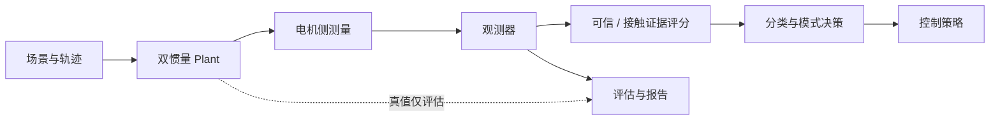

# 系统架构

## 模块边界

- Plant 产生电机侧测量与仅供评估的负载侧真值。
- Observer 只接受电机侧测量和名义参数，不能读取 Plant 真值。
- Score 输出工程评分；它们不是统计概率。
- Classification、Control、SIL 和应用层均在探针通过后才可推进。

## 当前状态

本 PR 仅建立契约层。已有编号目录中的内容不是本架构的验证证据，后续应由各自
PR 添加可运行的实现、测试与报告。
